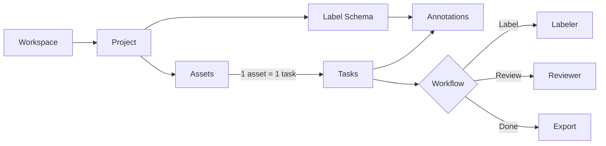

PixlHub has a small vocabulary that everything else builds on. Learn these seven concepts and every screen in the platform becomes predictable.

## The map

## The seven concepts

<AccordionGroup>
  <Accordion title="Workspace (organization)" defaultOpen>
    The container for everything: projects, members, storage. One account can belong to several workspaces, switched from the top bar; separate clients or trust boundaries belong in separate workspaces. Managed on the Organizations page. See [Teams and roles](/guides/essentials/teams-and-roles).
  </Accordion>
  <Accordion title="Project">
    One dataset-and-goal pairing with a fixed **tool type** (Image, LiDAR, Text or RLHF) that decides the editor. Owns its assets, schema, workflow, team activity and exports. See [Creating a project](/guides/projects/creating-a-project).
  </Accordion>
  <Accordion title="Asset">
    A unit of data you uploaded: an image, a point cloud, a document. Organized by upload **batches**, browsable in grid or list. See [Assets](/guides/essentials/assets).
  </Accordion>
  <Accordion title="Task">
    The unit of work: **every asset automatically becomes one task**, and tasks are what move through the workflow, get assigned, accumulate time and history. See [Tasks](/guides/essentials/tasks).
  </Accordion>
  <Accordion title="Label Schema">
    The project's vocabulary: classes with colors, hotkeys and attributes. Annotators arm a class and draw; the schema decides what "drawing" can mean. See [Label Schema](/guides/essentials/label-schema).
  </Accordion>
  <Accordion title="Annotation (instance)">
    One labeled thing: a box, polygon, point, line, freeform shape, cuboid or text span, carrying its class and an instance ID. Listed and managed in [Object Instances](/guides/basics/object-instances).
  </Accordion>
  <Accordion title="Workflow">
    The pipeline tasks travel: **Label → Review → Done** by default, extensible with model, agent and plugin steps in the visual editor. Review's accept and reject decisions are what turn labeled tasks into trusted data. See [Workflow](/guides/projects/workflow) and [Reviewing](/guides/quality/review-workflow).
  </Accordion>
</AccordionGroup>

## How a dataset actually flows

<Steps>
  <Step title="Set up">
    Create the project, define the schema, upload assets. Tasks appear automatically.
  </Step>
  <Step title="Produce">
    Labelers pull tasks, annotate with hotkeys and tools, submit. Models and [agents](/guides/ai/agents) can pre-label so humans correct instead of draw.
  </Step>
  <Step title="Verify">
    Reviewers accept or reject with pinned feedback; [performance metrics](/guides/quality/performance-analytics) track quality and pace weekly.
  </Step>
  <Step title="Deliver">
    Completed work exports in training-ready formats, partitioned by the splits and batches you maintained along the way.
  </Step>
</Steps>

## Next steps

<CardGroup cols={2}>
  <Card title="Quickstart" icon="rocket" href="/quickstart">
    The five-minute hands-on version of this page.
  </Card>
  <Card title="Image annotation editor" icon="image" href="/guides/annotation-modules/image-annotation-tool">
    Where most of these concepts meet your mouse.
  </Card>
</CardGroup>
